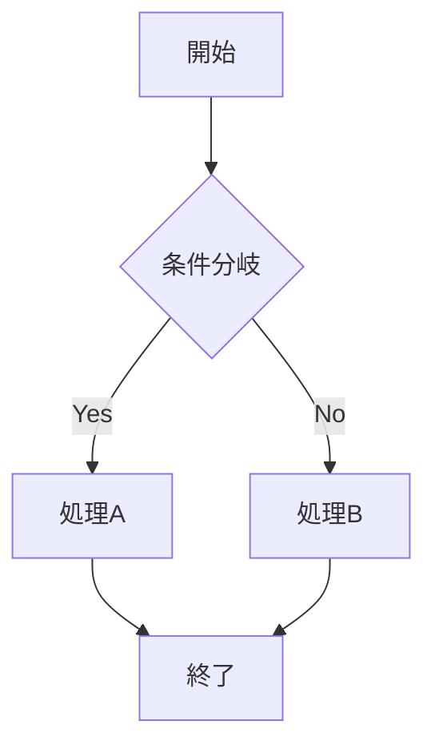

# 📊 Mermaid図表プレビュー設定ガイド

## 🎯 設定されたプレビュー方法

### **1. VS Code拡張機能（推奨）**
```bash
# VS Codeで以下の拡張機能が推奨されます
- Markdown Mermaid (bierner.markdown-mermaid)
- Mermaid Preview (vstirbu.vscode-mermaid-preview)  
- Mermaid Editor (tomoyukim.vscode-mermaid-editor)
```

**使い方:**
1. VS Codeで `.vscode/extensions.json` の推奨拡張機能をインストール
2. `docs/USECASE_DIAGRAMS.md` を開く
3. `Ctrl+Shift+P` → "Mermaid: Preview" でプレビュー表示

### **2. Docsifyローカルサーバー（リアルタイム）**
```bash
# ドキュメントサーバーを起動
npm run docs:install  # 初回のみ
npm run docs:serve    # http://localhost:3003 でサーバー起動
```

**特徴:**
- ✅ リアルタイムプレビュー
- ✅ 検索機能付き
- ✅ レスポンシブデザイン
- ✅ Mermaid図の自動レンダリング

### **3. GitHub Pages（本番公開）**
```bash
# GitHub Pagesで自動公開
# Settings → Pages → Source: GitHub Actions
```

**URL:** `https://dyamada-jaki.github.io/chat-analyzer`

### **4. 静的画像生成**
```bash
# Mermaid図をPNG画像として生成
npm run docs:build
```

## 🎨 Mermaidテーマ設定

現在のテーマ設定:
- **Primary Color**: `#ff6b6b` (赤系)
- **Secondary Color**: `#4ecdc4` (青緑系)  
- **Tertiary Color**: `#45b7d1` (青系)
- **Background**: デフォルト白

## 📋 利用可能な図表タイプ

- **フローチャート**: `flowchart TD`
- **シーケンス図**: `sequenceDiagram`
- **ユーザージャーニー**: `journey`
- **状態遷移図**: `stateDiagram-v2`
- **ガントチャート**: `gantt`
- **クラス図**: `classDiagram`
- **ER図**: `erDiagram`

## 🚀 クイックスタート

1. **VS Code使用の場合:**
   ```bash
   code docs/USECASE_DIAGRAMS.md
   # Ctrl+Shift+P → "Mermaid: Preview"
   ```

2. **ブラウザプレビューの場合:**
   ```bash
   npm run docs:serve
   # http://localhost:3003 を開く
   ```

3. **画像生成の場合:**
   ```bash
   npm run docs:build
   # docs/diagrams.png が生成される
   ```

## 🔧 トラブルシューティング

### Mermaid図が表示されない場合
1. VS Code拡張機能が正しくインストールされているか確認
2. Docsifyサーバーの場合、ブラウザのキャッシュをクリア
3. Mermaid記法に構文エラーがないか確認

### パフォーマンスが遅い場合
1. 複雑な図表を分割
2. ブラウザのハードウェアアクセラレーションを有効化
3. 不要なプラグインを無効化

## 📝 Mermaid記法例


