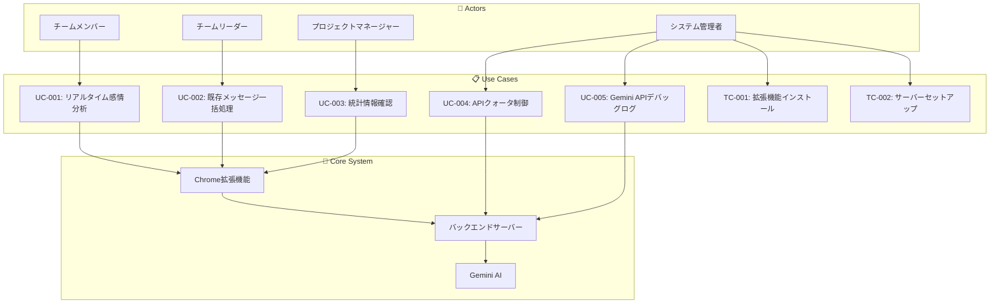
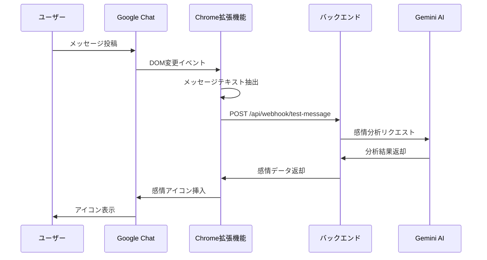
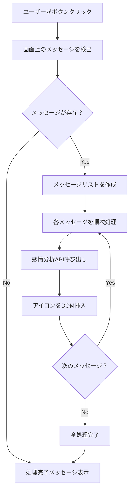
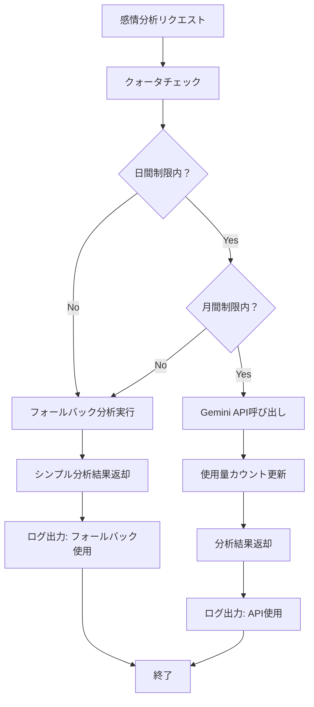
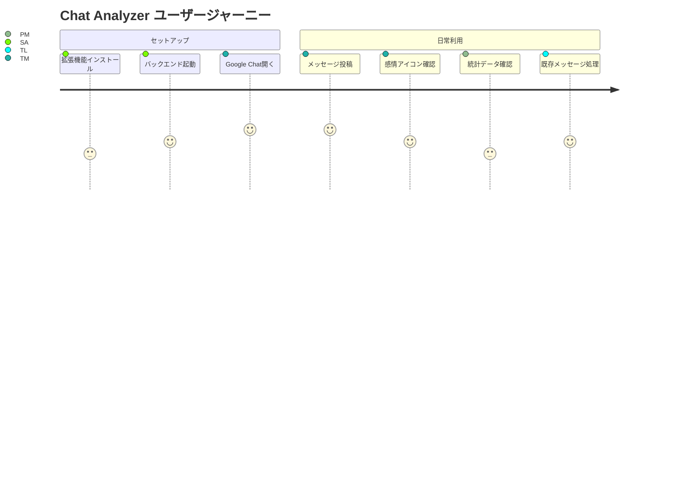
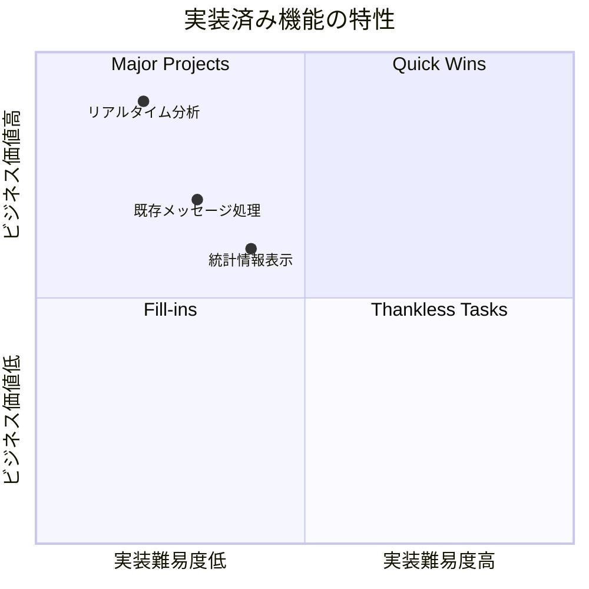
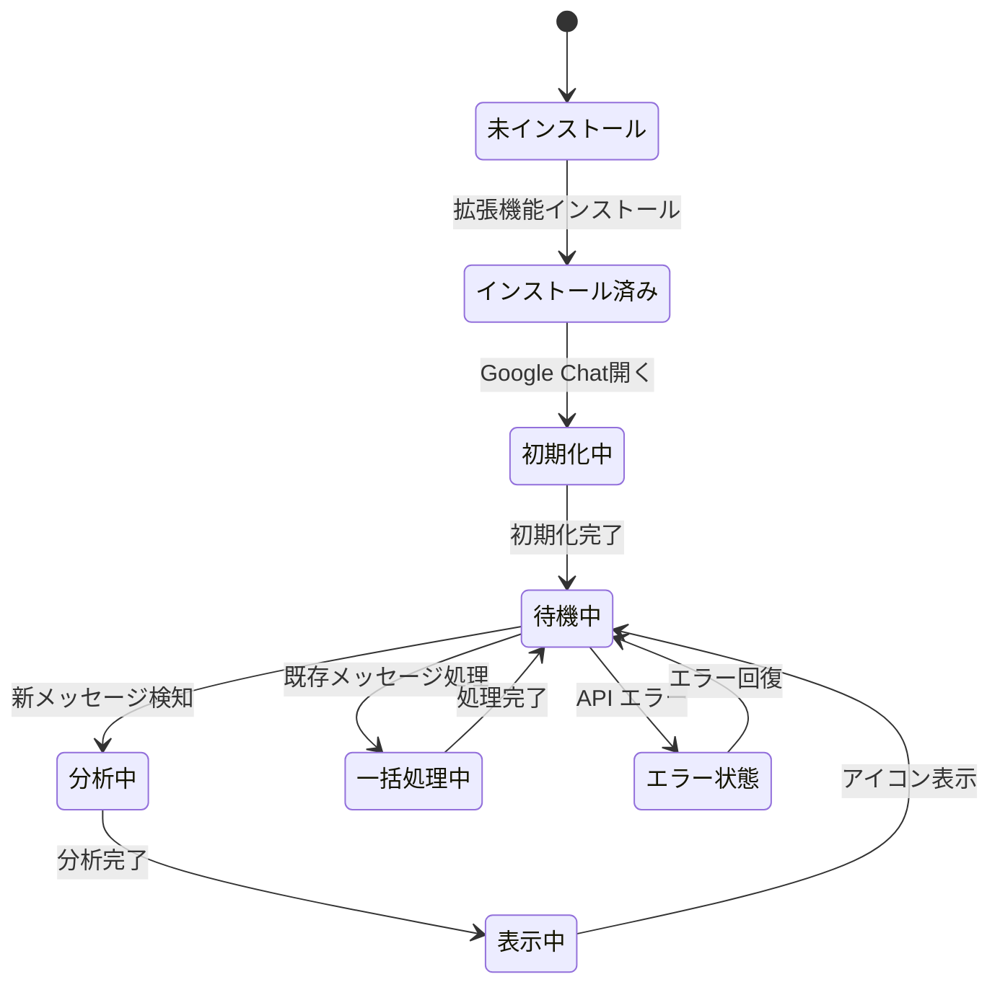
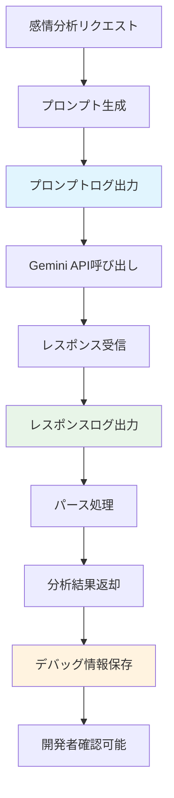

# 📊 Chat Analyzer ユースケース図 (実装済み機能)

## 🎯 システム概要図

## 🔄 ユースケースフロー図

### UC-001: リアルタイム感情分析フロー

### UC-002: 既存メッセージ一括処理フロー

### UC-004: APIクォータ制御フロー

## 🎯 ユーザージャーニーマップ

## 📊 実装済み機能マトリックス

## 🔄 状態遷移図

### UC-005: Gemini APIデバッグログフロー

